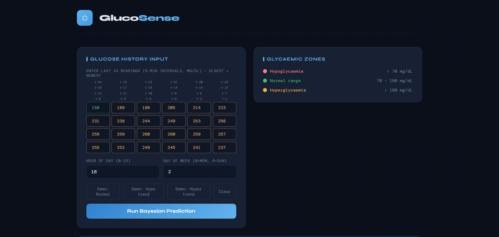
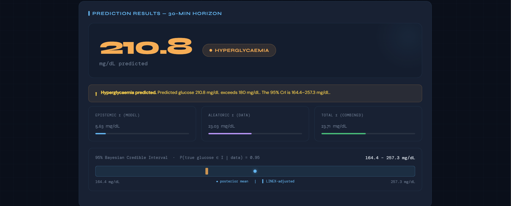

# Blood Glucose Prediction Using Bayesian Neural Network

Uncertainty-aware **blood glucose forecasting** for Type 1 Diabetes using a **Bayesian Bidirectional GRU** with Monte Carlo Dropout, Attention Mechanism, and Bayesian Linear output layers.  
This project applies deep statistical inference to produce not just predictions, but **calibrated confidence intervals** for clinical decision support.

---

## Team Members

| Name | Roll Number |
|------|-------------|
| Janapareddy Vidya Varshini | 230041013 |
| Korubilli Vaishnavi | 230041016 |
| Mullapudi Namaswi | 230041023 |

---

##  Problem Statement

> Build an uncertainty-aware blood glucose prediction system for Type 1 Diabetes patients that predicts glucose levels **30 minutes ahead** while simultaneously quantifying **epistemic** (model) and **aleatoric** (data) uncertainty.

Traditional glucose prediction models produce a single point estimate — clinically insufficient because a prediction of 130 mg/dL with ±50 mg/dL uncertainty is very different from the same prediction with ±5 mg/dL uncertainty. This project addresses that gap through a full Bayesian neural network pipeline trained on the **OhioT1DM benchmark dataset**.

---

## Dataset — OhioT1DM

| Property | Value |
|----------|-------|
| Source | OhioT1DM |
| Patients | 6 Type 1 Diabetes patients |
| Sampling interval | 5 minutes (CGM device) |
| Training sequences | 69,147 |
| Test sequences | 15,862 |
| Input window | 24 readings = 2 hours |
| Prediction horizon | 6 steps = **30 minutes** |
| MLE mean (μ) | 160.13 mg/dL |
| MLE std (σ) | 55.17 mg/dL |

Data is parsed from XML files. Feature engineering is performed **per patient** (no cross-patient leakage): 5 lag features, 5 rolling statistics, 2 difference features, hour of day, and day of week — **14 features total**.

---

##  Statistical Inference Concepts Applied

| Concept | Application |
|---------|-------------|
| **MLE & MME** | Fit Normal distribution to glucose population; estimate μ and σ |
| **Fisher Information** | Compute I(μ) = n/σ² and FIM; assess estimation precision |
| **Cramér-Rao Lower Bound** | Prove UMVUE achieves minimum variance |
| **Bayesian Conjugate Priors** | Normal-Normal conjugate update; informative, non-informative, and Jeffreys' priors compared |
| **Posterior Mean & Median** | Both computed and compared under three prior scenarios |
| **Interval Estimation** | Frequentist CI via pivotal quantity vs Bayesian 95% Credible Interval |
| **SEL / Absolute / LINEX Loss** | Three loss frameworks compared; LINEX asymmetry applied clinically |
| **Transformations of RVs** | Log-transform of glucose via delta method |

---

##  Model Architecture

The model follows the paper architecture exactly:

```
Input (24 × 14)
      │
      ▼
BiGRU — 3 Layers, Hidden=50, Bidirectional, Dropout=0.3
      │
      ▼
Attention Mechanism
  Project: (2H → 2H, tanh)
  Context: (2H → 1, softmax) → attention weights over 24 steps
      │
      ▼
MC Dropout (kept ON at test time)
      │
      ▼
BayesianLinear 
  w = μ_w + softplus(ρ_w) · ε,   ε ~ N(0,1)
      │
      ├── Output 1: Predicted mean  (μ)
      └── Output 2: Log variance    (log σ²_aleatoric)
```

**Uncertainty Decomposition (50 MC Dropout passes):**
- Epistemic σ = √Var(50 means) — model uncertainty, reducible
- Aleatoric σ = √Mean(50 variances) — data noise, irreducible
- Total σ = √(epistemic² + aleatoric²)

---

##  Training Configuration

| Parameter | Value |
|-----------|-------|
| Framework | PyTorch |
| Optimizer | Adam, lr = 0.0001 |
| Loss | NLL + KL Divergence (λ = 0.01) |
| Max epochs | 50 (early stopping at epoch **42**) |
| Early stopping patience | 15 |
| Batch size | 64 |
| Dropout | 0.3 |
| MC Dropout passes | 50 |

---

## Results

### Key Metrics

| Metric | Value |
|--------|-------|
| RMSE (Squared Error Loss) | **22.04 mg/dL** |
| MAE (Absolute Error Loss) | 15.49 mg/dL | 
| R² | 0.9411 | 
| LINEX (a=+0.05, overest. penalty) | 2.5909 |
| LINEX (a=−0.05, underest. penalty) | 2.1559 | 
| ±2σ Coverage | **96.49%** | 
| Best training epoch | 42 / 50 |

### Uncertainty by Glycaemic Zone

| Metric | Hypo (<70) | Normal (70–180) | Hyper (>180) |
|--------|-----------|-----------------|--------------|
| % of samples | 2.3% | 55.9% | 41.8% |
| Mean Epistemic σ | 7.08 mg/dL | 4.02 mg/dL | 6.44 mg/dL |
| Mean Aleatoric σ | 22.73 mg/dL | 21.73 mg/dL | 25.39 mg/dL |
| RMSE by zone | 22.87 mg/dL | 19.21 mg/dL | 25.29 mg/dL |

**Overall safety margin (95% CrI coverage): 96.49%**

---


## Web Application — GlucoSense

An interactive clinical web app built with **Flask + HTML/CSS/JavaScript**.

> **Input:** 24 glucose readings (5-minute intervals, 2-hour window)  
> **Output:** Full Bayesian prediction with uncertainty decomposition

### Features
- Real-time glucose colour coding — red (hypo), amber (hyper), green (normal)
- Epistemic σ, aleatoric σ, total σ with proportional bar charts
- 95% Bayesian Credible Interval shown as an interactive range bar
- LINEX-adjusted prediction (a = +0.05) alongside posterior mean
- Histogram of all 50 MC Dropout sample outputs
- Glycaemic zone classification with clinical alert
- Demo buttons: Normal / Hypo trend / Hyper trend scenarios

### Screenshots


  
  

---

## How to Run

### Step 1 — Clone the Repository

```bash
git clone https://github.com/eepsitavaishnavi/Blood-Glucose-Prediction-Using-Bayesian-Neural-Network
cd Blood-Glucose-Prediction-Using-Bayesian-Neural-Network
```

### Step 2 — Create Virtual Environment

```bash
python -m venv venv
source venv/bin/activate        # Linux / Mac
venv\Scripts\activate           # Windows
```

### Step 3 — Install Dependencies

```bash
pip install torch torchvision scikit-learn matplotlib seaborn scipy joblib flask numpy pandas
```

### Step 4 — Prepare the Dataset

Download the OhioT1DM dataset and place it at:
```
data/
└── OhioT1DM/
    ├── training/
    │   ├── 559-ws-training.xml
    │   ├── 563-ws-training.xml
    │   └── ...
    └── testing/
        ├── 559-ws-testing.xml
        └── ...
```

### Step 5 — Train the Model 

Open `Bayesian_Glucose.ipynb` in Google Colab, mount your Drive, and run all cells.  
The trained model and scalers will be saved to your Drive:

```
BayesianBiGRU_Outputs/
├── best_bigru_model.pt
├── scaler_X.pkl
└── scaler_y.pkl
```

### Step 6 — Run the Web Application

Copy the saved files into the `glucose_app/` folder:

```
glucose_app/
├── app.py
├── best_bigru_model.pt     ← from Drive
├── scaler_X.pkl            ← from Drive
├── scaler_y.pkl            ← from Drive
└── templates/
    └── index.html
```

Then run:

```bash
cd glucose_app
python app.py
```

Open your browser at **http://localhost:5000**

##  Dependencies

```txt
torch>=2.0.0
numpy>=1.23.0
pandas>=1.5.0
scikit-learn>=1.2.0
scipy>=1.9.0
matplotlib>=3.5.0
seaborn>=0.12.0
joblib>=1.2.0
flask>=2.3.0
```
